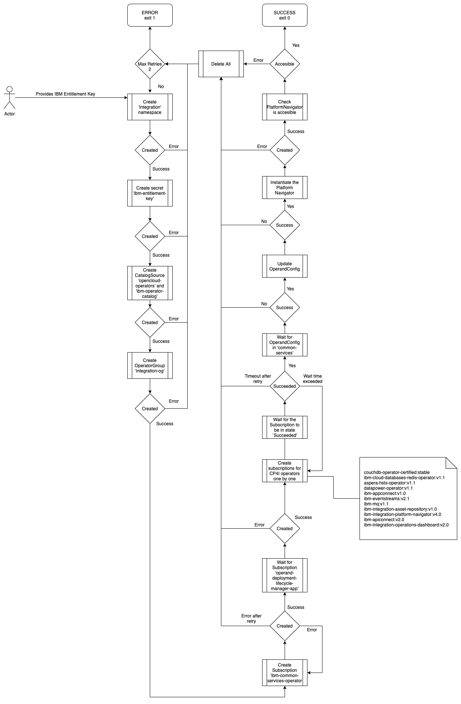
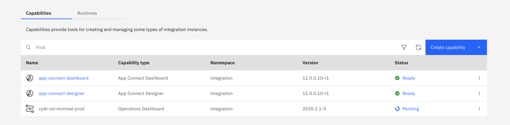
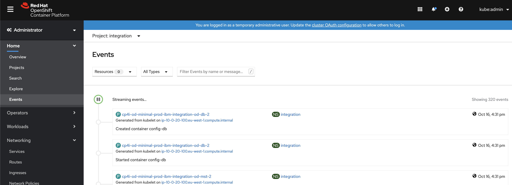
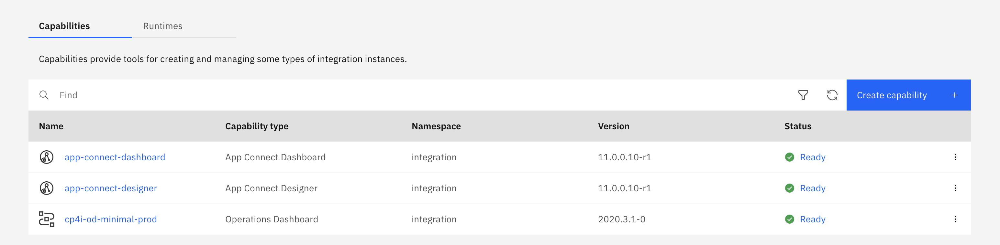

# Cloud Pak for Integration Deployment

## Overview

bash scripts to automate install/unstall CP4I on an existing openshift cluster project

## Prerequisites

- Bash Terminal
- Existing OpenShift Cluster with version > 4.4.13

## Installation

- login in to your openshift cluster in the terminal

- run the installation script giving the namespace/project ibm entitlement key as arguments, if you don't give the namespace it will take a default value of `cp4i`

```
   cp4i-install.sh -n cp4i -k mykey
```

- It will do the following:
  - Creates the Openshift Project if it does not already exist
  - Creates IBM Entitlement Key Secret
  - Installs Open Cloud Operator Catalog
  - Installs IBM Cloud Operator Catalog
  - Installs Operator Group
  - Installs IBM Common Services Operator
  - Waits for Operand Deployment Lifecycle Manager to be installed
  - Installs the CP4I operators one by one and wait for each to be installed in the following order:
    - Operator for Apache CouchDB
    - IBM Operator for Redis
    - IBM Aspera HSTS
    - IBM DataPower Gateway
    - IBM App Connect
    - IBM Event Streams
    - IBM MQ
    - IBM Cloud Pak for Integration Asset Repository
    - IBM Cloud Pak for Integration Platform Navigator
    - IBM API Connect
    - IBM Cloud Pak for Integration Operations Dashboard
  - Waits for OperandConfig to be installed
  - Update the OperandConfig 'common-service' for IAM Authentication
  - Instantiate Platform Navigator and Wait for it to be ready
  - Release subscriptions that are still in "UpgradePending" state

## Addtional Arguments

### Waiting time for each operator to be installed

The script waits for each operator 30 minutes to be installed, if the time passes 120 minutes for any operator it's considered an error. To change the waiting time pass the `-w` argument which takes the time in seconds, so to make it 20 minutes we do the following:

```
  cp4i-install.sh -n integration -k mykey -w 1200
```

### Maximum number of installation trials

If the whole installation fails, the script triggers the uninstall script to remove everything has been done and tries to install everything again with maximum 2 trials. To change the number of maximum trials pass the `-t` argument, so to make it 10 we do the following

```
 cp4i-install.sh -n mynamespace -k mykey -w 1200 -t 10
```

If the installtion exceeds maximum number of trials, it uninstall everything without doing any further installtion and it will throw this message

`Max Install Trial Reached, exiting now`

### Accessing Platform Navigator

When the installation is finished the Cloud Pak for Integration is available on your cluster and can be managed through the Platform Navigator UI.

Get the route of the Platform navigator by opening the OpenShift admin console, then go to `Networking` and select `Routes`, there should be an entry `<namespace>-navigator-pn` with the URL in the `Location` tab.

Alternatively you can get it form the cli (with jq installed):

```bash
oc get route -n ${namespace} ${namespace}-navigator-pn -o json | jq -r .spec.host
```

To login to the Platform Navigator UI you can either use the OpenShift credentials (e.g. `kubeadmin`) or the `Default authentication`. The username is `admin` and the password can be retreived via cli:

```bash
oc get secrets -n ibm-common-services platform-auth-idp-credentials -ojsonpath='{.data.admin_password}' | base64 --decode && echo ""
```

## Error Handling and Retry Mechanism

- Project creation fails: Exit installation and perform a new try until max trials is reached
- Secret creation fails: Exit installation and perform a new try until max trials is reached
- Operator catalog installation fails: Exit installation and perform a new try until max trials is reached
- Operator Group creation fails: Exit installation and perform a new try until max trials is reached
- Operator installation fails: If the operator is not installed after the specified maximum wait time or it got status failed, the script retries to reinstall it one time, if it fails again it uninstalls everything performs a new try until max trials is reached
- Operand Deployment Lifecycle Manager fails: If the operator is not installed after the specified maximum wait time or it got status failed, the script uninstalls everything performs a new try until max trials is reached
- OperandConfig fails: uninstall everything and perform next try
- IAM Update fails: uninstall everything and perform next try
- Instantiate Platform navigator: If the instantiation fails the script performs a retry (over and over again). If the instantiation is successfull but the UI is not reachable, everything is uninstalled and a retry is triggered if not exceeding the maximum number of retries.

## Logs

by default or logs are written to screen, to write them to a file simple use the following bash code

```
: > cp4i-logs.txt &&
./cp4i-install.sh  -n integraion -k mykey | tee -a cp4i-logs.txt
```

this first line `: > cp4i-logs.txt` will cleat the file if it exists so if you want commulative logs remove this line.
the pipe `| tee -a cp4i-logs.txt` will clone every output from the the script to the text file.

## Uninstallation

- login in to your openshift cluster in the terminal
- run the uninstallation script giving the namespace/project as a flag argument,if you don't give the namespace it will take a default value of `integration`

```
   cp4i-uninstall.sh -n mynamespace
```

- It will automatically delete all components and operators of CP4I

- To Uninstall everything including the common services run the script

```
  cp4i-uninstall-with-commonservices.sh -n mynamespace
```

## Flow of the installation



### Installing Capabilities Within Installation of CP4I

To install additional capabilites add the following flags.

- flag `-1 true` installs API Connect with values of 
- flag `-2 true` installs App Connect Dashboard
- flag `-3 true` installs App Connect Designer
- flag `-4 true` installs Operations Dashboard
- flag `-5 true` installs Asset Repository

example

```bash
cp4i-install.sh -n integration -k mykey -1 true -2 true -3 true -4 true -5 true
```

If the installation fails it is not retried and not uninstalled.

### Installing Runtimes Within Installation of CP4I

To install additional runtimes add the following flags.

- flag `-6 true` installs MQ
- flag `-7 true` installs Kafka Event Streams
- flag `-8 true` installs Aspera (requires -a flag with the absolute path to a keyfile with an Aspera license key)
- flag `-9 true` install DataPower Gateway (creates secret `datapower-admin-credentials`)

example

```bash
cp4i-install.sh -n integration -k mykey -6 true -7 true -8 true -9 true -a absolute_path_to_aspera_keyfile
```

If the installation fails it is not retried and not uninstalled.

## Installing Capabilities as Standalone installation

### Installation from Platfom Navigator UI

Find that latest guide on this link
https://www.ibm.com/support/knowledgecenter/SSGT7J_20.2/install/deployments.html

### Installation from AWS bootnode

- Login to your AWS bootnode server
- Navigat to scripts directory

```bash
 cd  /ibm/cp4i-deployment/capabilities-runtimes-scripts
```

- Run the command for the desired capability, bellow there are examples for each one of them:

  1- Operations Dashboard

  ```bash
    ./release-tracing.sh -n ${namespace} -r ${release_name} -f ${file_torage} -b ${block_storage} -p
    # -p is optional flag, adding it installs the capability in production mode
  ```

  example:

  ```bash
  ./release-tracing.sh -n integration -r operations-dashbaord -f ocs-storagecluster-cephfs -b gp2 -p
  ```

  2- API Connect

  ```bash
    ./release-apic.sh -n ${namespace} -r ${release_name} -p
    # -p is optional flag, adding it installs the capability in production mode
  ```

  example:

  ```bash
  ./release-apic.sh -n integration -r api-connect -p
  ```

  3- APP Connect Dashboard

  ```bash
    ./release-ace-dashboard.sh -n ${namespace} -r ${release_name} -s ${storageClass} -p
    # -p is optional flag, adding it installs the capability in production mode
  ```

  example:

  ```bash
    ./release-ace-dashboard.sh -n integration -r app-connect-dashboard -s ocs-storagecluster-cephfs -p
  ```

  4- APP Connect Designer

  ```bash
    ./release-ace-designer.sh -n ${namespace} -r ${release_name} -s ${storageClass} -p
    # -p is optional flag, adding it installs the capability in production mode
  ```

  example:

  ```bash
    ./release-ace-designer.sh -n integration -r app-connect-designer -s ocs-storagecluster-cephfs -p
  ```

  5- Assets Repository

  ```bash
    ./release-ar.sh -n ${namespace} -r ${release_name} -a ${assetDataVolumeClass} -c ${couchVolumeClass}

    # -p is optional flag, adding it installs the capability in production mode
  ```

  example:

  ```bash
   ./release-ar.sh --n integration -r assets-repo -a ocs-storagecluster-cephfs -c ocs-storagecluster-cephfs -p
  ```

- The Capability will be created in `Pending` Status
  

- If you want to trace installation progress, you can monitor the Events by going to the OpenShift admin console and navigate to `Events` as shown in the following.



- Wait for the capabiltiy to be in `Ready` status
  

## Installing Runtimes as Standalone installation

### Installation from Platfom Navigator UI

Find that latest guide on this link
https://www.ibm.com/support/knowledgecenter/SSGT7J_20.2/install/deployments.html

### Installation from AWS bootnode

- Login to your AWS bootnode server
- Navigate to scripts directory

```bash
 cd  /ibm/cp4i-deployment/capabilities-runtimes-scripts
```

- Run the command for the desired runtime, bellow there are examples for each one of them:

  1- MQ

  ```bash
    ./release-mq.sh -n ${namespace} -r ${release_name}  -z ${namespace}
    # -z is the namespace in which the tracing capability is installed
  ```

  example:

  ```bash
  ./release-mq.sh -n integration -r mq -z integration
  ```

  2- Kafka Event Streams

  ```bash
    ./release-es.sh -n ${namespace} -r ${release_name}  -p -c ${storageClass}
    # -p is optional flag, adding it installs the capability in minimal production mode
  ```

  example:

  ```bash
  ./release-es.sh -n integration -r kafka -p -c ocs-storagecluster-cephfs
  ```

  3- Aspera

  ```bash
    ./release-aspera.sh -n ${namespace} -r ${release_name} -p -c ${storageClass} -k ${asperaKeyFilePath}
    # -p is optional flag, adding it installs the capability in production mode
    # -k is the absolute path to an Aspera license file
  ```

  example:

  ```bash
    ./release-aspera.sh -n integration -r aspera -p -c ocs-storagecluster-cephfs -k /Users/admin/Downloads/aspera-license-file
  ```

  4- DataPower Gateway

  ```bash
    ./release-datapower.sh -n ${namespace} -r ${release_name} -p -a ${admin_password}
    # -p is optional flag, adding it installs the capability in production mode
  ```

  example:

  ```bash
    ./release-datapower.sh -n integration -r datapower -p -a admin
  ```

- The Runtime will be created in `Pending` Status
  

- If you want to trace installation progress, you can monitor the Events by going to the OpenShift admin console and navigate to `Events` as shown in the following.


- Wait for the runtime to be in `Ready` status
  

## Possible errors when installing capabilities and runtimes

This section will contain some errors that might happen during the installation of capabilities or runtimes and also contain some information about how to resolve them.

### Not enough resources

When installing capabilities or runtimes it might happen that the capability or runtime (e.g. Even Streams) stays in `Pending` state because not all the pods are comming up. Most of the times this is due to not enough resources, so the kubernetes scheduler can not place the pods. To check if that is the case open the OpenShift admin console and navigate to `Events` as shown in the following.


This can be resolved by either uninstalling not needed capabilities and runtimes or by adding more worker nodes to the cluster until the resource requirements are fulfilled.

### Other errors

If the installations is still in `Pending` after a long time or is in status `Failed` it might be that the cluster was not yet ready or there was another temporary error.

This can be resolved by uninstalling and reinstalling the capability or runtime.

Make sure to check if the configuration is correct before reinstalling.

If reinstalling does not solve it here are some places for debugging:

- OpenShift provides a list of events in the admin console, therefore go to `Home` -> `Events` and select the namespace the capabilities and runtimes are installed in
- In case a pod is failing check the logs of the pod by going to the admin console and open `Workloads` -> `Pods` and then search for the failing pod and click on it. Then select `Logs` to view the logs or `Events` to view the events related to that pod

## Additional Links

[Cloud Pak for Integration Installation Guide](https://www.ibm.com/support/knowledgecenter/SSGT7J_20.2/install/install.html)
